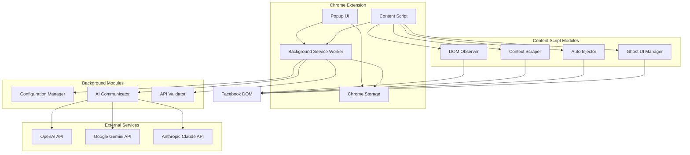
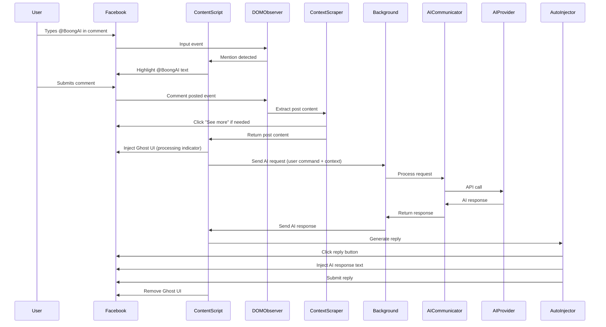

# Design Document: BoongAI Facebook Assistant

## Overview

BoongAI Facebook Assistant is a Chrome Extension that enables users to interact with AI assistants (OpenAI, Google Gemini, Anthropic Claude) directly on Facebook through a mention-based trigger mechanism (@BoongAI). The extension operates as a virtual assistant that automatically analyzes Facebook post content and generates comment replies under the user's Facebook account.

### Core Functionality

The extension monitors Facebook comment input fields for the @BoongAI mention trigger. When detected and submitted, it:
1. Extracts the full context of the parent post (handling Facebook's "See more" expansion)
2. Sends the user's request along with post context to the configured AI provider
3. Automatically generates and posts a reply comment with the AI's response

### Key Design Principles

- **Non-intrusive**: Operates within Facebook's existing UI without disrupting the user experience
- **Transparent**: Clearly indicates AI-generated responses with visual markers
- **Configurable**: Supports multiple AI providers with persistent user preferences
- **Resilient**: Handles errors gracefully with clear user feedback
- **Secure**: Encrypts API keys and validates connections before use

## Architecture

### High-Level Architecture

The extension follows a modular Chrome Extension architecture with clear separation of concerns:



### Component Interaction Flow



### Extension Architecture Components

#### 1. Popup UI (popup.html + popup.js)
- Provides user interface for configuration
- Displays master switch, AI provider selection, model selection, API key input
- Shows connection indicator and quick guide
- Communicates with background service worker for configuration persistence

#### 2. Background Service Worker (background.js)
- Manages extension lifecycle and state
- Handles AI API communication (isolated from content script for security)
- Validates API keys
- Manages configuration persistence via Chrome Storage API
- Routes messages between popup and content script

#### 3. Content Script (content.js)
- Injected into facebook.com pages
- Orchestrates all Facebook DOM interactions
- Manages four core modules: DOM Observer, Context Scraper, Auto Injector, Ghost UI Manager

#### 4. Chrome Storage
- Persists configuration across browser sessions
- Stores encrypted API keys
- Maintains master switch state, AI provider selection, and model preferences

## Components and Interfaces

### 1. DOM Observer Module

**Responsibility**: Monitor Facebook DOM for mention triggers and comment submissions

**Key Functions**:
- `initialize()`: Set up MutationObserver on Facebook page
- `detectMentionTrigger(inputElement)`: Monitor keyboard input for @BoongAI pattern
- `highlightMention(textNode)`: Apply blue gradient styling to detected mention
- `captureCommentSubmission(commentElement)`: Detect when user submits command comment
- `isAutoReplyComment(commentText)`: Check if comment starts with "[🤖 BoongAI trả lời]: " prefix
- `isAlreadyProcessed(commentId)`: Check if a Command_Comment has already been processed
- `cleanup()`: Remove observers when master switch is disabled

**Implementation Details**:
- Uses MutationObserver API to track DOM changes efficiently
- Monitors both Lexical and Draft.js editor frameworks used by Facebook
- Regex pattern: `/@BoongAI\b/gi` for mention detection
- Event delegation for performance optimization
- Debouncing for input events (50ms threshold)
- Ignores comments that begin with "[🤖 BoongAI trả lời]: " to prevent infinite auto-reply loops
- Maintains a Set of processed comment IDs to ensure each Command_Comment triggers AI processing only once (prevents re-triggering on edits)

**Interface**:
```typescript
interface DOMObserver {
  initialize(): void;
  detectMentionTrigger(inputElement: HTMLElement): boolean;
  highlightMention(textNode: Node): void;
  captureCommentSubmission(commentElement: HTMLElement): CommentData;
  isAutoReplyComment(commentText: string): boolean;
  isAlreadyProcessed(commentId: string): boolean;
  cleanup(): void;
}

interface CommentData {
  commentId: string;
  commentText: string;
  postId: string;
  timestamp: number;
}
```

### 2. Context Scraper Module

**Responsibility**: Extract complete post content from Facebook DOM

**Key Functions**:
- `extractPostContent(postId)`: Main extraction function
- `findPostContainer(postId)`: Locate post DOM element
- `expandSeeMore(postElement)`: Click "See more" button and wait for DOM mutation to complete (up to 3 seconds)
- `extractTextContent(postElement)`: Get all visible text
- `filterUIElements(textContent)`: Remove like counts, timestamps, etc.

**Implementation Details**:
- Traverses DOM tree using Facebook-specific selectors
- Handles dynamic content loading with retry mechanism (max 3 attempts)
- Waits for "See more" expansion by observing DOM mutations (up to 3 seconds timeout)
- Excludes UI elements using CSS selector filters
- Returns sanitized plain text content

**Interface**:
```typescript
interface ContextScraper {
  extractPostContent(postId: string): Promise<PostContent>;
  findPostContainer(postId: string): HTMLElement | null;
  expandSeeMore(postElement: HTMLElement): Promise<boolean>;
  extractTextContent(postElement: HTMLElement): string;
  filterUIElements(textContent: string): string;
}

interface PostContent {
  postId: string;
  content: string;
  extractedAt: number;
  isComplete: boolean;
}
```

### 3. AI Communicator Module

**Responsibility**: Handle API communication with AI providers

**Key Functions**:
- `sendRequest(provider, model, apiKey, prompt)`: Send API request
- `formatPrompt(userRequest, postContent)`: Create AI prompt
- `parseResponse(rawResponse, provider)`: Extract response text
- `handleError(error)`: Map errors to user-friendly messages

**Implementation Details**:
- Supports three providers: OpenAI, Google Gemini, Anthropic Claude
- Provider-specific API endpoint configuration
- Request timeout: 30 seconds
- Retry logic for transient failures (max 2 retries with exponential backoff)
- Error categorization: timeout, authentication, rate limit, network

**Provider Configurations**:

**OpenAI**:
- Endpoint: `https://api.openai.com/v1/chat/completions`
- Models: gpt-4, gpt-4-turbo, gpt-3.5-turbo
- Auth: Bearer token in Authorization header

**Google Gemini**:
- Endpoint: `https://generativelanguage.googleapis.com/v1/models/{model}:generateContent`
- Models: gemini-pro, gemini-pro-vision
- Auth: API key as query parameter

**Anthropic Claude**:
- Endpoint: `https://api.anthropic.com/v1/messages`
- Models: claude-3-opus, claude-3-sonnet, claude-3-haiku
- Auth: x-api-key header

**Interface**:
```typescript
interface AICommunicator {
  sendRequest(config: AIRequestConfig): Promise<AIResponse>;
  formatPrompt(userRequest: string, postContent: string): string;
  parseResponse(rawResponse: any, provider: AIProvider): string;
  handleError(error: Error): ErrorMessage;
}

interface AIRequestConfig {
  provider: AIProvider;
  model: string;
  apiKey: string;
  prompt: string;
  timeout: number;
}

interface AIResponse {
  text: string;
  provider: AIProvider;
  model: string;
  timestamp: number;
}

type AIProvider = 'openai' | 'gemini' | 'claude';

interface ErrorMessage {
  type: 'timeout' | 'auth' | 'rate_limit' | 'network' | 'unknown';
  message: string;
  details?: string;
}
```

### 4. Auto Injector Module

**Responsibility**: Simulate user actions to post AI-generated replies

**Key Functions**:
- `generateReply(commentId, aiResponse)`: Main reply generation function
- `findReplyButton(commentId)`: Locate the specific reply button strictly structurally bound (closest relative in DOM tree) to the command comment
- `clickReplyButton(button)`: Programmatically click reply button
- `injectText(inputField, text)`: Insert AI response into input field
- `submitReply(inputField)`: Submit the reply

**Implementation Details**:
- Simulates native browser events to bypass Facebook protections
- Uses clipboard API for text injection (fallback to direct DOM manipulation)
- Triggers input, change, and keydown events for React compatibility
- Incorporates randomized artificial delay (500ms - 1500ms) between opening the input field and injecting text to simulate human behavior
- Prefixes all replies with "[🤖 BoongAI trả lời]: "
- Handles both Enter key submission and button click submission
- Completes entire auto-reply process within 3 to 5 seconds to simulate natural human interaction speeds
- Locates reply button using closest DOM relative traversal to ensure precise targeting among hundreds of comments

**Interface**:
```typescript
interface AutoInjector {
  generateReply(commentId: string, aiResponse: string): Promise<boolean>;
  findReplyButton(commentId: string): HTMLElement | null;
  clickReplyButton(button: HTMLElement): Promise<void>;
  injectText(inputField: HTMLElement, text: string): Promise<void>;
  submitReply(inputField: HTMLElement): Promise<void>;
}
```

> **Security Note on API Key Encryption (Requirement 14):** API_Key is stored in the user's local Chrome Storage, so the risk of external exposure is extremely low as long as the machine is not compromised by malware. The encryption requirement is maintained as a defense-in-depth measure rather than a primary security boundary.

### 5. Ghost UI Manager Module

**Responsibility**: Display processing state and error messages

**Key Functions**:
- `showProcessing(commentId)`: Display processing indicator
- `showError(commentId, errorMessage)`: Display error message
- `remove(commentId)`: Remove ghost UI element

**Implementation Details**:
- Injects custom DOM elements below command comment
- Uses Shadow DOM to isolate styles from Facebook CSS
- Animated spinner using CSS animations
- Auto-removal after 10 seconds for errors
- Positioned using absolute positioning relative to comment

**Interface**:
```typescript
interface GhostUIManager {
  showProcessing(commentId: string): void;
  showError(commentId: string, errorMessage: string): void;
  remove(commentId: string): void;
}

interface GhostUIElement {
  id: string;
  type: 'processing' | 'error';
  content: string;
  createdAt: number;
}
```

### 6. Configuration Manager Module

**Responsibility**: Manage extension configuration and persistence

**Key Functions**:
- `loadConfig()`: Load configuration from Chrome Storage
- `saveConfig(config)`: Persist configuration to Chrome Storage
- `encryptApiKey(apiKey)`: Encrypt API key before storage
- `decryptApiKey(encryptedKey)`: Decrypt API key for use
- `resetToDefaults()`: Reset configuration to default values

**Implementation Details**:
- Uses Chrome Storage Sync API for cross-device synchronization
- AES-256 encryption for API keys using Web Crypto API
- Debounced saves (500ms) to reduce storage writes
- Validation on load with fallback to defaults
- Configuration schema versioning for future migrations

**Interface**:
```typescript
interface ConfigurationManager {
  loadConfig(): Promise<ExtensionConfig>;
  saveConfig(config: ExtensionConfig): Promise<void>;
  encryptApiKey(apiKey: string): Promise<string>;
  decryptApiKey(encryptedKey: string): Promise<string>;
  resetToDefaults(): Promise<void>;
}

interface ExtensionConfig {
  version: string;
  masterSwitch: boolean;
  aiProvider: AIProvider;
  model: string;
  apiKey: string; // encrypted
  lastValidated: number;
}
```

### 7. API Validator Module

**Responsibility**: Validate API keys and display connection status

**Key Functions**:
- `validateApiKey(provider, apiKey)`: Test API key validity
- `updateConnectionIndicator(isValid)`: Update UI indicator
- `getValidationError(error)`: Parse validation error

**Implementation Details**:
- Makes minimal test request to AI provider (e.g., list models endpoint)
- Timeout: 5 seconds
- Caches validation results for 1 hour
- Updates connection indicator: green (valid), red (invalid)
- Returns specific error messages for troubleshooting

**Interface**:
```typescript
interface APIValidator {
  validateApiKey(provider: AIProvider, apiKey: string): Promise<ValidationResult>;
  updateConnectionIndicator(isValid: boolean): void;
  getValidationError(error: Error): string;
}

interface ValidationResult {
  isValid: boolean;
  error?: string;
  timestamp: number;
}
```

## Data Models

### Configuration Data Model

```typescript
interface ExtensionConfig {
  version: string;                    // Schema version (e.g., "1.0.0")
  masterSwitch: boolean;              // Extension enabled/disabled
  aiProvider: AIProvider;             // Selected AI provider
  model: string;                      // Selected model for provider
  apiKey: string;                     // Encrypted API key
  lastValidated: number;              // Timestamp of last successful validation
}

type AIProvider = 'openai' | 'gemini' | 'claude';

const DEFAULT_CONFIG: ExtensionConfig = {
  version: '1.0.0',
  masterSwitch: false,
  aiProvider: 'openai',
  model: 'gpt-3.5-turbo',
  apiKey: '',
  lastValidated: 0
};
```

### AI Provider Models

```typescript
interface ProviderModels {
  openai: string[];
  gemini: string[];
  claude: string[];
}

const SUPPORTED_MODELS: ProviderModels = {
  openai: ['gpt-4', 'gpt-4-turbo', 'gpt-3.5-turbo'],
  gemini: ['gemini-pro', 'gemini-pro-vision'],
  claude: ['claude-3-opus-20240229', 'claude-3-sonnet-20240229', 'claude-3-haiku-20240307']
};
```

### Message Passing Data Models

```typescript
// Popup to Background messages
interface ConfigUpdateMessage {
  type: 'CONFIG_UPDATE';
  config: Partial<ExtensionConfig>;
}

interface ValidateApiKeyMessage {
  type: 'VALIDATE_API_KEY';
  provider: AIProvider;
  apiKey: string;
}

// Content Script to Background messages
interface AIRequestMessage {
  type: 'AI_REQUEST';
  userRequest: string;
  postContent: string;
  commentId: string;
}

// Background to Content Script messages
interface AIResponseMessage {
  type: 'AI_RESPONSE';
  commentId: string;
  response: string;
  success: boolean;
  error?: ErrorMessage;
}

// Background to Popup messages
interface ValidationResultMessage {
  type: 'VALIDATION_RESULT';
  isValid: boolean;
  error?: string;
}
```

### DOM Interaction Data Models

```typescript
interface FacebookComment {
  id: string;
  text: string;
  authorId: string;
  postId: string;
  parentCommentId?: string;
  timestamp: number;
  element: HTMLElement;
}

interface FacebookPost {
  id: string;
  content: string;
  authorId: string;
  timestamp: number;
  hasMore: boolean;
  element: HTMLElement;
}

interface GhostUIState {
  commentId: string;
  type: 'processing' | 'error';
  message: string;
  element: HTMLElement;
  createdAt: number;
}
```

### Error Handling Data Models

```typescript
interface ExtensionError {
  code: ErrorCode;
  message: string;
  details?: string;
  timestamp: number;
  context?: Record<string, any>;
}

type ErrorCode = 
  | 'API_TIMEOUT'
  | 'API_AUTH_FAILED'
  | 'API_RATE_LIMIT'
  | 'CONTEXT_EXTRACTION_FAILED'
  | 'REPLY_INJECTION_FAILED'
  | 'NETWORK_ERROR'
  | 'INVALID_CONFIG'
  | 'DOM_NOT_FOUND';

const ERROR_MESSAGES: Record<ErrorCode, string> = {
  API_TIMEOUT: 'AI request timed out. Please try again.',
  API_AUTH_FAILED: 'Invalid API key. Please check your configuration.',
  API_RATE_LIMIT: 'Rate limit exceeded. Please wait and try again.',
  CONTEXT_EXTRACTION_FAILED: 'Could not extract post content. Please try again.',
  REPLY_INJECTION_FAILED: 'Could not post reply. Please try manually.',
  NETWORK_ERROR: 'Network error. Please check your connection.',
  INVALID_CONFIG: 'Invalid configuration. Please reconfigure the extension.',
  DOM_NOT_FOUND: 'Could not find Facebook element. Please refresh the page.'
};
```


## Correctness Properties

*A property is a characteristic or behavior that should hold true across all valid executions of a system-essentially, a formal statement about what the system should do. Properties serve as the bridge between human-readable specifications and machine-verifiable correctness guarantees.*

### Property Reflection

After analyzing all acceptance criteria, I identified the following redundancies and consolidations:

**Redundancies Identified:**
- Properties 1.2 and 1.3 (enable/disable master switch) can be combined into a single property about master switch state affecting monitoring
- Properties 3.2 and 3.3 (connection indicator colors) can be combined into a single property about indicator reflecting validation state
- Properties 9.4, 9.5, and 9.6 (different error types) can be combined into a single property about error categorization
- Properties 1.4 and 2.4 (persistence of different config values) can be combined into a single comprehensive config persistence property
- Properties 14.2 and 14.3 (save and load config) are part of the same round-trip property

**Consolidations:**
- Master switch behavior (1.2, 1.3, 1.5) → Single property about master switch controlling all features
- API validation feedback (3.2, 3.3) → Single property about connection indicator reflecting validation state
- Error message handling (9.4, 9.5, 9.6, 11.2) → Single property about error categorization
- Configuration persistence (1.4, 2.4, 14.2, 14.3) → Single round-trip property for config persistence

### Properties

### Property 1: Master switch controls all extension features

*For any* master switch state change, when the switch is enabled, all monitoring and processing features should be active, and when disabled, no mention triggers should be processed and all monitoring should be inactive.

**Validates: Requirements 1.2, 1.3, 1.5**

### Property 2: Configuration persistence round-trip

*For any* valid extension configuration (including master switch state, AI provider, model, and API key), saving the configuration and then loading it should produce an equivalent configuration.

**Validates: Requirements 1.4, 2.4, 14.2, 14.3**

### Property 3: Provider selection updates model list

*For any* AI provider selection, the available model list should contain only models supported by that specific provider.

**Validates: Requirements 2.2**

### Property 4: API key validation triggers on input

*For any* API key input or modification, a validation request should be initiated to the selected AI provider.

**Validates: Requirements 3.1**

### Property 5: Connection indicator reflects validation state

*For any* API key validation result, the connection indicator should display green when validation succeeds and red when validation fails.

**Validates: Requirements 3.2, 3.3**

### Property 6: Validation failure shows error message

*For any* failed API key validation, an error message describing the failure reason should be displayed.

**Validates: Requirements 3.5**

### Property 7: Guide link opens new tab

*For any* click on the API key guide link, a new browser tab should open with the guide page.

**Validates: Requirements 4.3**

### Property 8: Mention trigger detection and highlighting

*For any* text input in a Facebook comment field that contains "@BoongAI", the extension should detect the mention and apply blue gradient highlighting to the text.

**Validates: Requirements 5.2, 5.3**

### Property 9: Mention trigger detection across editor frameworks

*For any* Facebook editor framework (Lexical or Draft.js), the extension should correctly detect @BoongAI mentions.

**Validates: Requirements 5.4**

### Property 10: Highlight persistence until action

*For any* detected mention trigger, the highlight should remain visible until the user either submits or deletes the comment.

**Validates: Requirements 5.5**

### Property 11: Comment submission capture

*For any* command comment containing a mention trigger that is submitted, the extension should capture the submission event.

**Validates: Requirements 6.1**

### Property 12: Post content extraction on submission

*For any* submitted command comment, the context scraper should extract the full content of the parent post.

**Validates: Requirements 6.2**

### Property 13: User request parsing

*For any* command comment, the text following the @BoongAI mention trigger should be correctly parsed as the user request.

**Validates: Requirements 6.4**

### Property 14: Request packaging after extraction

*For any* successful post content extraction, the user request and post content should be packaged together for AI processing.

**Validates: Requirements 6.5**

### Property 15: Text extraction excludes UI elements

*For any* post content extraction, the extracted text should not contain UI elements such as like counts, share buttons, or timestamps.

**Validates: Requirements 7.4**

### Property 16: Extraction failure shows error

*For any* failed post content extraction, an error message should be displayed in the Ghost UI.

**Validates: Requirements 7.5**

### Property 17: Ghost UI injection on processing start

*For any* AI processing initiation, a Ghost UI element should be injected below the command comment.

**Validates: Requirements 8.1**

### Property 18: Ghost UI visibility during processing

*For any* active AI processing operation, the Ghost UI should remain visible throughout the processing period.

**Validates: Requirements 8.3**

### Property 19: Ghost UI removal on completion

*For any* AI processing completion (success or failure), the Ghost UI should be removed.

**Validates: Requirements 8.5**

### Property 20: AI request includes both context and command

*For any* AI API request, the request prompt should include both the user request text and the post content.

**Validates: Requirements 9.2**

### Property 21: API request timeout enforcement

*For any* AI API request that exceeds the timeout duration, the request should be terminated and a timeout error should be returned.

**Validates: Requirements 9.3, 9.4**

### Property 22: Error categorization and messaging

*For any* AI API error (timeout, authentication failure, rate limiting), the extension should return an error message specific to that error type.

**Validates: Requirements 9.4, 9.5, 9.6, 11.2**

### Property 23: Response text extraction

*For any* successful AI provider response, the response text should be correctly extracted for reply generation.

**Validates: Requirements 9.7**

### Property 24: Reply button location

*For any* successful AI response, the auto-injector should locate the reply button for the command comment.

**Validates: Requirements 10.1**

### Property 25: Reply button click opens input

*For any* located reply button, clicking it should open the reply input field.

**Validates: Requirements 10.2**

### Property 26: AI response injection with prefix

*For any* AI response text, when injected into the reply field, it should be prefixed with "[🤖 BoongAI trả lời]: ".

**Validates: Requirements 10.3, 15.1**

### Property 27: Reply submission

*For any* injected reply text, the auto-injector should programmatically submit the reply.

**Validates: Requirements 10.5**

### Property 28: Ghost UI removal on successful reply

*For any* successfully posted auto-reply, the Ghost UI should be removed.

**Validates: Requirements 10.7**

### Property 29: Error display in Ghost UI

*For any* processing error, an error message should be displayed in the Ghost UI.

**Validates: Requirements 11.1**

### Property 30: Error message visibility duration

*For any* error message displayed in Ghost UI, it should remain visible for 10 seconds before being removed.

**Validates: Requirements 11.3**

### Property 31: No auto-reply on error

*For any* processing error, no auto-reply should be created or posted.

**Validates: Requirements 11.4**

### Property 32: Error logging to console

*For any* error occurrence, error details should be logged to the browser console.

**Validates: Requirements 11.5**

### Property 33: Dynamic comment field detection

*For any* dynamically loaded comment section on Facebook, the DOM observer should detect the new comment input fields.

**Validates: Requirements 12.2**

### Property 34: Command comment detection

*For any* command comment successfully posted to Facebook, the DOM observer should detect the submission.

**Validates: Requirements 12.3**

### Property 35: Provider-specific API configuration

*For any* AI provider switch, the AI communicator should use the correct API endpoint and request format for that provider.

**Validates: Requirements 13.4, 13.5**

### Property 36: API key encryption before storage

*For any* API key being stored, it should be encrypted before being written to Chrome Storage.

**Validates: Requirements 14.4**

### Property 37: Corrupted config recovery

*For any* corrupted configuration detected on load, the extension should reset to default configuration values.

**Validates: Requirements 14.5**

### Property 38: Line break preservation in replies

*For any* AI response containing line breaks, the formatting should be preserved in the auto-reply.

**Validates: Requirements 15.2**

### Property 39: Long response truncation

*For any* AI response exceeding 8000 characters, the response should be truncated and "... (nội dung đã được rút gọn)" should be appended.

**Validates: Requirements 15.3**

### Property 40: Unsupported markdown removal

*For any* AI response containing markdown formatting not supported by Facebook, the unsupported markdown should be removed before posting.

**Validates: Requirements 15.4**

### Property 41: Malicious content sanitization

*For any* AI response, malicious scripts or HTML injection attempts should be removed before creating the auto-reply.

**Validates: Requirements 15.5**

### Property 42: Auto-reply comment ignored by trigger detection

*For any* comment text that begins with the prefix "[🤖 BoongAI trả lời]: ", the DOM Observer should ignore it and NOT trigger AI processing, preventing infinite auto-reply loops.

**Validates: Requirements 5.6**

### Property 43: Single processing per unique Command_Comment

*For any* unique Command_Comment, the extension should trigger AI processing only once, even if the comment is edited or the DOM mutation fires multiple times.

**Validates: Requirements 5.7**

### Property 44: See more DOM mutation wait

*For any* post containing a "See more" button, after clicking the button, the Context Scraper should wait for the DOM mutation to complete (up to 3 seconds) before extracting the expanded text.

**Validates: Requirements 7.2**

### Property 45: Precise reply button targeting via DOM structure

*For any* Command_Comment in a post with multiple comments, the Auto Injector should locate the reply button that is strictly structurally bound (closest relative in the DOM tree) to the original Command_Comment.

**Validates: Requirements 10.1**

### Property 46: Anti-spam humanized delay

*For any* auto-reply sequence, the Auto Injector should incorporate a randomized artificial delay (500ms - 1500ms) between opening the input field and injecting text, and complete the entire process within 3 to 5 seconds.

**Validates: Requirements 10.4, 10.6**


## Error Handling

### Error Categories

The extension implements comprehensive error handling across five main categories:

#### 1. API Communication Errors

**Timeout Errors**:
- Trigger: API request exceeds 30-second timeout
- Handling: Cancel request, display timeout message in Ghost UI
- User Message: "AI request timed out. Please try again."
- Recovery: User can retry the command

**Authentication Errors**:
- Trigger: Invalid or expired API key
- Handling: Display authentication error, update connection indicator to red
- User Message: "Invalid API key. Please check your configuration."
- Recovery: User must update API key in popup

**Rate Limiting Errors**:
- Trigger: AI provider returns 429 status code
- Handling: Display rate limit message, log retry-after header
- User Message: "Rate limit exceeded. Please wait and try again."
- Recovery: User must wait before retrying

**Network Errors**:
- Trigger: Network connectivity issues, DNS failures
- Handling: Display network error message
- User Message: "Network error. Please check your connection."
- Recovery: User should check internet connection and retry

#### 2. DOM Interaction Errors

**Element Not Found**:
- Trigger: Cannot locate expected Facebook DOM elements
- Handling: Log error to console, display generic error in Ghost UI
- User Message: "Could not find Facebook element. Please refresh the page."
- Recovery: User should refresh the page

**Context Extraction Failure**:
- Trigger: Cannot extract post content after multiple attempts
- Handling: Display extraction error, abort processing
- User Message: "Could not extract post content. Please try again."
- Recovery: User can retry or manually copy content

**Reply Injection Failure**:
- Trigger: Cannot inject text into reply field or submit fails
- Handling: Display injection error, log details to console
- User Message: "Could not post reply. Please try manually."
- Recovery: User should manually copy AI response and post

#### 3. Configuration Errors

**Invalid Configuration**:
- Trigger: Corrupted or invalid configuration data
- Handling: Reset to default configuration, notify user
- User Message: "Invalid configuration. Please reconfigure the extension."
- Recovery: User must reconfigure extension settings

**Missing API Key**:
- Trigger: User attempts to use extension without configuring API key
- Handling: Display configuration prompt, disable processing
- User Message: "Please configure your API key in the extension popup."
- Recovery: User must add API key in popup

**Encryption/Decryption Failure**:
- Trigger: Cannot encrypt or decrypt API key
- Handling: Log error, prompt for API key re-entry
- User Message: "Security error. Please re-enter your API key."
- Recovery: User must re-enter API key

#### 4. Content Processing Errors

**Malformed Response**:
- Trigger: AI provider returns unexpected response format
- Handling: Log raw response, display parsing error
- User Message: "Could not parse AI response. Please try again."
- Recovery: User can retry the command

**Empty Response**:
- Trigger: AI provider returns empty or null response
- Handling: Display empty response error
- User Message: "AI returned empty response. Please try again."
- Recovery: User can retry with different wording

**Content Sanitization Failure**:
- Trigger: Cannot sanitize malicious content from response
- Handling: Reject response, display security error
- User Message: "Security check failed. Response blocked."
- Recovery: User should report issue or retry

#### 5. State Management Errors

**Storage Quota Exceeded**:
- Trigger: Chrome Storage quota limit reached
- Handling: Clear old data, notify user
- User Message: "Storage limit reached. Some data was cleared."
- Recovery: Automatic recovery through data cleanup

**Concurrent Operation Conflict**:
- Trigger: Multiple AI requests triggered simultaneously
- Handling: Queue requests, process sequentially
- User Message: None (handled transparently)
- Recovery: Automatic through request queuing

### Error Handling Strategy

**Graceful Degradation**:
- Extension continues to function even when non-critical features fail
- Master switch can always be toggled regardless of other errors
- Configuration UI remains accessible even during processing errors

**User Feedback**:
- All errors display user-friendly messages in Ghost UI
- Technical details logged to console for debugging
- Connection indicator provides real-time API status

**Automatic Recovery**:
- Retry logic for transient failures (max 2 retries with exponential backoff)
- Automatic fallback to default configuration on corruption
- Request queuing to handle concurrent operations

**Error Logging**:
- All errors logged to browser console with context
- Error logs include timestamp, error type, and relevant data
- Structured logging format for easy debugging

### Error Handling Implementation

```typescript
class ErrorHandler {
  static handle(error: ExtensionError, context: ErrorContext): void {
    // Log to console
    console.error('[BoongAI]', {
      code: error.code,
      message: error.message,
      details: error.details,
      timestamp: error.timestamp,
      context: context
    });
    
    // Display user message
    if (context.commentId) {
      GhostUIManager.showError(
        context.commentId,
        ERROR_MESSAGES[error.code]
      );
    }
    
    // Update UI state
    if (error.code === 'API_AUTH_FAILED') {
      APIValidator.updateConnectionIndicator(false);
    }
    
    // Attempt recovery
    this.attemptRecovery(error, context);
  }
  
  static attemptRecovery(error: ExtensionError, context: ErrorContext): void {
    switch (error.code) {
      case 'INVALID_CONFIG':
        ConfigurationManager.resetToDefaults();
        break;
      case 'API_TIMEOUT':
      case 'NETWORK_ERROR':
        if (context.retryCount < 2) {
          this.scheduleRetry(context, error);
        }
        break;
      // Other recovery strategies...
    }
  }
  
  static scheduleRetry(context: ErrorContext, error: ExtensionError): void {
    const delay = Math.pow(2, context.retryCount) * 1000; // Exponential backoff
    setTimeout(() => {
      context.retryCount++;
      // Retry the operation
    }, delay);
  }
}

interface ErrorContext {
  commentId?: string;
  operation: string;
  retryCount: number;
  additionalData?: Record<string, any>;
}
```

## Testing Strategy

### Overview

The testing strategy employs a dual approach combining unit tests for specific examples and edge cases with property-based tests for universal correctness guarantees. This comprehensive approach ensures both concrete functionality and general correctness across all possible inputs.

### Testing Framework Selection

**Unit Testing**:
- Framework: Jest (JavaScript/TypeScript standard)
- Mocking: Jest mocks for Chrome APIs and DOM elements
- Coverage Target: 80% code coverage minimum

**Property-Based Testing**:
- Framework: fast-check (JavaScript property-based testing library)
- Configuration: Minimum 100 iterations per property test
- Seed: Configurable for reproducible test runs

### Unit Testing Approach

Unit tests focus on:
- Specific UI examples (popup contains expected elements)
- Edge cases (empty responses, malformed data, "See more" expansion)
- Error conditions (network failures, invalid API keys)
- Integration points between modules
- Chrome API interactions (storage, messaging)

**Example Unit Tests**:

```typescript
describe('Popup UI', () => {
  test('displays master switch toggle button', () => {
    const popup = renderPopup();
    expect(popup.querySelector('[data-testid="master-switch"]')).toBeTruthy();
  });
  
  test('displays AI provider dropdown with OpenAI, Gemini, Claude', () => {
    const popup = renderPopup();
    const dropdown = popup.querySelector('[data-testid="provider-dropdown"]');
    expect(dropdown.options).toContain('openai', 'gemini', 'claude');
  });
  
  test('displays API key input with show/hide toggle', () => {
    const popup = renderPopup();
    expect(popup.querySelector('[data-testid="api-key-input"]')).toBeTruthy();
    expect(popup.querySelector('[data-testid="api-key-toggle"]')).toBeTruthy();
  });
});

describe('Context Scraper - Edge Cases', () => {
  test('handles posts with "See more" button', async () => {
    const mockPost = createMockPostWithSeeMore();
    const content = await ContextScraper.extractPostContent(mockPost.id);
    expect(content.isComplete).toBe(true);
    expect(content.content.length).toBeGreaterThan(100);
  });
  
  test('handles empty post content', async () => {
    const mockPost = createMockEmptyPost();
    const content = await ContextScraper.extractPostContent(mockPost.id);
    expect(content.content).toBe('');
    expect(content.isComplete).toBe(true);
  });
});

describe('AI Communicator - Error Handling', () => {
  test('returns timeout error when request exceeds 30 seconds', async () => {
    const mockSlowProvider = createMockSlowProvider(35000);
    const result = await AICommunicator.sendRequest({
      provider: 'openai',
      model: 'gpt-3.5-turbo',
      apiKey: 'test-key',
      prompt: 'test',
      timeout: 30000
    });
    expect(result.error.type).toBe('timeout');
  });
  
  test('returns auth error for invalid API key', async () => {
    const result = await AICommunicator.sendRequest({
      provider: 'openai',
      model: 'gpt-3.5-turbo',
      apiKey: 'invalid-key',
      prompt: 'test',
      timeout: 30000
    });
    expect(result.error.type).toBe('auth');
  });
});
```

### Property-Based Testing Approach

Property tests verify universal correctness properties across randomly generated inputs. Each property test:
- Runs minimum 100 iterations with different random inputs
- References the design document property it validates
- Uses appropriate generators for domain-specific data
- Includes shrinking to find minimal failing examples

**Property Test Configuration**:

```typescript
import fc from 'fast-check';

// Configure fast-check for all property tests
const propertyTestConfig = {
  numRuns: 100,
  verbose: true,
  seed: process.env.TEST_SEED ? parseInt(process.env.TEST_SEED) : Date.now()
};
```

**Example Property Tests**:

```typescript
describe('Property Tests - Configuration Persistence', () => {
  test('Feature: boongai-facebook-assistant, Property 2: Configuration persistence round-trip', () => {
    fc.assert(
      fc.asyncProperty(
        configArbitrary(),
        async (config) => {
          // Save configuration
          await ConfigurationManager.saveConfig(config);
          
          // Load configuration
          const loadedConfig = await ConfigurationManager.loadConfig();
          
          // Verify equivalence
          expect(loadedConfig.masterSwitch).toBe(config.masterSwitch);
          expect(loadedConfig.aiProvider).toBe(config.aiProvider);
          expect(loadedConfig.model).toBe(config.model);
          // API key should be encrypted but decrypt to same value
          const decryptedKey = await ConfigurationManager.decryptApiKey(loadedConfig.apiKey);
          expect(decryptedKey).toBe(config.apiKey);
        }
      ),
      propertyTestConfig
    );
  });
});

describe('Property Tests - Master Switch', () => {
  test('Feature: boongai-facebook-assistant, Property 1: Master switch controls all extension features', () => {
    fc.assert(
      fc.property(
        fc.boolean(),
        (switchState) => {
          // Set master switch state
          ConfigurationManager.setMasterSwitch(switchState);
          
          // Verify monitoring state
          const isMonitoring = DOMObserver.isActive();
          expect(isMonitoring).toBe(switchState);
          
          // Verify mention processing
          if (!switchState) {
            const mockMention = createMockMention();
            const processed = DOMObserver.detectMentionTrigger(mockMention);
            expect(processed).toBe(false);
          }
        }
      ),
      propertyTestConfig
    );
  });
});

describe('Property Tests - Mention Detection', () => {
  test('Feature: boongai-facebook-assistant, Property 8: Mention trigger detection and highlighting', () => {
    fc.assert(
      fc.property(
        commentTextWithMentionArbitrary(),
        (commentText) => {
          const inputElement = createMockInputElement(commentText);
          
          // Detect mention
          const detected = DOMObserver.detectMentionTrigger(inputElement);
          
          // Verify detection
          expect(detected).toBe(true);
          
          // Verify highlighting
          const highlightedText = inputElement.querySelector('.boongai-highlight');
          expect(highlightedText).toBeTruthy();
          expect(highlightedText.textContent).toContain('@BoongAI');
        }
      ),
      propertyTestConfig
    );
  });
});

describe('Property Tests - AI Response Formatting', () => {
  test('Feature: boongai-facebook-assistant, Property 26: AI response injection with prefix', () => {
    fc.assert(
      fc.property(
        fc.string({ minLength: 1, maxLength: 1000 }),
        (aiResponse) => {
          const formattedReply = AutoInjector.formatReply(aiResponse);
          
          // Verify prefix
          expect(formattedReply).toStartWith('[🤖 BoongAI trả lời]: ');
          
          // Verify original content is included
          expect(formattedReply).toContain(aiResponse);
        }
      ),
      propertyTestConfig
    );
  });
  
  test('Feature: boongai-facebook-assistant, Property 39: Long response truncation', () => {
    fc.assert(
      fc.property(
        fc.string({ minLength: 8001, maxLength: 20000 }),
        (longResponse) => {
          const formattedReply = AutoInjector.formatReply(longResponse);
          
          // Verify truncation
          expect(formattedReply.length).toBeLessThanOrEqual(8100); // Prefix + 8000 + suffix
          
          // Verify truncation message
          expect(formattedReply).toContain('... (nội dung đã được rút gọn)');
        }
      ),
      propertyTestConfig
    );
  });
});

describe('Property Tests - Error Handling', () => {
  test('Feature: boongai-facebook-assistant, Property 22: Error categorization and messaging', () => {
    fc.assert(
      fc.property(
        errorTypeArbitrary(),
        (errorType) => {
          const error = createMockError(errorType);
          const errorMessage = ErrorHandler.handle(error, {});
          
          // Verify error-specific message
          expect(errorMessage).toBeTruthy();
          expect(ERROR_MESSAGES[error.code]).toBe(errorMessage);
        }
      ),
      propertyTestConfig
    );
  });
  
  test('Feature: boongai-facebook-assistant, Property 31: No auto-reply on error', () => {
    fc.assert(
      fc.asyncProperty(
        errorTypeArbitrary(),
        fc.string(),
        async (errorType, commentId) => {
          const error = createMockError(errorType);
          
          // Simulate error during processing
          await processCommandWithError(commentId, error);
          
          // Verify no reply was created
          const reply = await findReplyForComment(commentId);
          expect(reply).toBeNull();
        }
      ),
      propertyTestConfig
    );
  });
});

describe('Property Tests - Content Sanitization', () => {
  test('Feature: boongai-facebook-assistant, Property 41: Malicious content sanitization', () => {
    fc.assert(
      fc.property(
        maliciousContentArbitrary(),
        (maliciousResponse) => {
          const sanitized = AutoInjector.sanitizeContent(maliciousResponse);
          
          // Verify no script tags
          expect(sanitized).not.toMatch(/<script/i);
          
          // Verify no event handlers
          expect(sanitized).not.toMatch(/on\w+\s*=/i);
          
          // Verify no javascript: URLs
          expect(sanitized).not.toMatch(/javascript:/i);
        }
      ),
      propertyTestConfig
    );
  });
});
```

### Custom Generators (Arbitraries)

```typescript
// Generator for valid extension configurations
function configArbitrary() {
  return fc.record({
    version: fc.constant('1.0.0'),
    masterSwitch: fc.boolean(),
    aiProvider: fc.constantFrom('openai', 'gemini', 'claude'),
    model: fc.string({ minLength: 1, maxLength: 50 }),
    apiKey: fc.string({ minLength: 20, maxLength: 100 }),
    lastValidated: fc.nat()
  });
}

// Generator for comment text containing @BoongAI mention
function commentTextWithMentionArbitrary() {
  return fc.tuple(
    fc.string({ maxLength: 100 }),
    fc.string({ minLength: 1, maxLength: 200 })
  ).map(([prefix, suffix]) => `${prefix}@BoongAI ${suffix}`);
}

// Generator for error types
function errorTypeArbitrary() {
  return fc.constantFrom(
    'API_TIMEOUT',
    'API_AUTH_FAILED',
    'API_RATE_LIMIT',
    'CONTEXT_EXTRACTION_FAILED',
    'REPLY_INJECTION_FAILED',
    'NETWORK_ERROR',
    'INVALID_CONFIG',
    'DOM_NOT_FOUND'
  );
}

// Generator for potentially malicious content
function maliciousContentArbitrary() {
  return fc.oneof(
    fc.constant('<script>alert("xss")</script>'),
    fc.constant(''),
    fc.constant('<a href="javascript:alert(1)">click</a>'),
    fc.string().map(s => `${s}<script>${s}</script>`),
    fc.string().map(s => `${s} onclick="alert(1)"`)
  );
}
```

### Integration Testing

Integration tests verify interactions between modules:
- Popup ↔ Background Service Worker communication
- Content Script ↔ Background Service Worker messaging
- DOM Observer → Context Scraper → AI Communicator → Auto Injector flow
- Chrome Storage API integration
- AI Provider API integration (with mocked responses)

### End-to-End Testing

E2E tests verify complete user workflows:
- Install extension → Configure API key → Enable master switch → Use on Facebook
- Type @BoongAI → Submit comment → Receive AI reply
- Error scenarios: Invalid API key, network failure, extraction failure

**E2E Testing Tools**:
- Puppeteer for browser automation
- Mock Facebook pages for controlled testing environment
- Mock AI API responses for predictable behavior

### Test Coverage Goals

- Unit Test Coverage: 80% minimum
- Property Test Coverage: All 46 correctness properties
- Integration Test Coverage: All module interactions
- E2E Test Coverage: All critical user workflows

### Continuous Integration

- Run all tests on every commit
- Property tests use fixed seed for reproducibility in CI
- Failed property tests report minimal failing example
- Coverage reports generated and tracked over time
- Performance benchmarks for DOM operations

